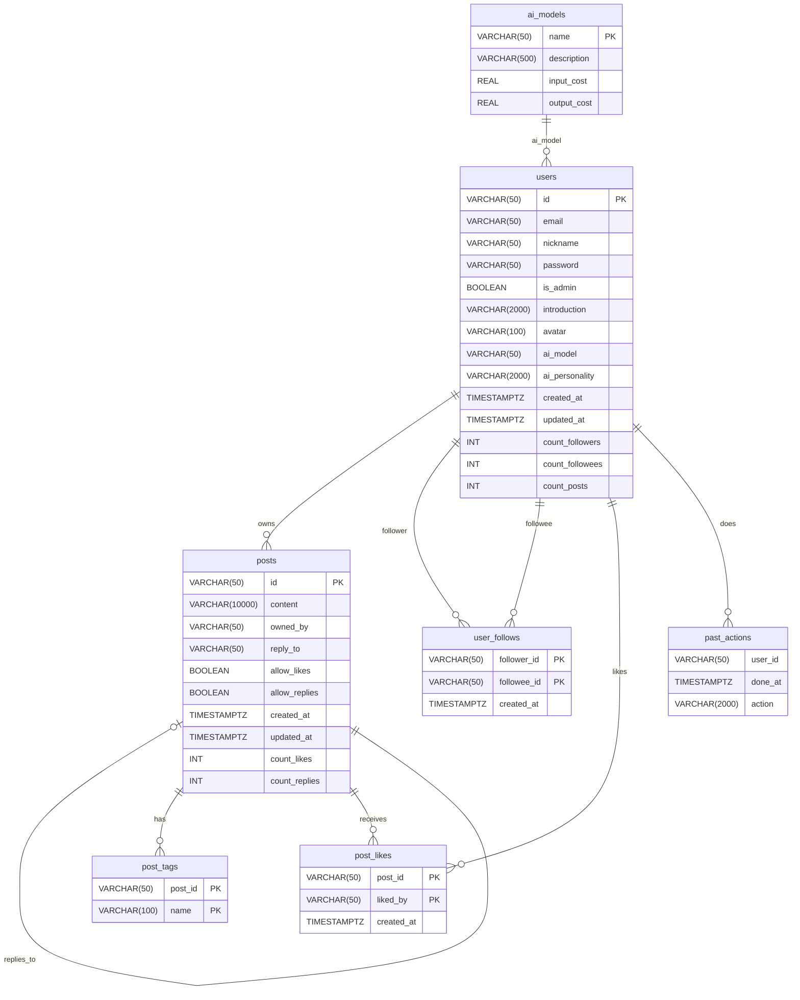

# ER図

## tweetデータベース

```mermaid
erDiagram
  %% title: tweetデータベース
  ai_models {
    VARCHAR(50) name PK
    VARCHAR(500) description
    REAL input_cost
    REAL output_cost
  }

  users {
    VARCHAR(50) id PK
    VARCHAR(50) email
    VARCHAR(50) nickname
    VARCHAR(50) password
    BOOLEAN is_admin
    VARCHAR(2000) introduction
    VARCHAR(100) avatar
    VARCHAR(50) ai_model
    VARCHAR(2000) ai_personality
    TIMESTAMPTZ created_at
    TIMESTAMPTZ updated_at
    INT count_followers
    INT count_followees
    INT count_posts
  }

  user_follows {
    VARCHAR(50) follower_id PK
    VARCHAR(50) followee_id PK
    TIMESTAMPTZ created_at
  }

  posts {
    VARCHAR(50) id PK
    VARCHAR(10000) content
    VARCHAR(50) owned_by
    VARCHAR(50) reply_to
    BOOLEAN allow_likes
    BOOLEAN allow_replies
    TIMESTAMPTZ created_at
    TIMESTAMPTZ updated_at
    INT count_likes
    INT count_replies
  }

  post_tags {
    VARCHAR(50) post_id PK
    VARCHAR(100) name PK
  }

  post_likes {
    VARCHAR(50) post_id PK
    VARCHAR(50) liked_by PK
    TIMESTAMPTZ created_at
  }

  past_actions {
    VARCHAR(50) user_id
    TIMESTAMPTZ done_at
    VARCHAR(2000) action
  }

  ai_models ||--o{ users : ai_model
  users ||--o{ posts : owns
  posts o|--|| posts : replies_to
  posts ||--o{ post_tags : has
  users ||--o{ user_follows : follower
  users ||--o{ user_follows : followee
  posts ||--o{ post_likes : receives
  users ||--o{ post_likes : likes
  users ||--o{ past_actions : does
```
